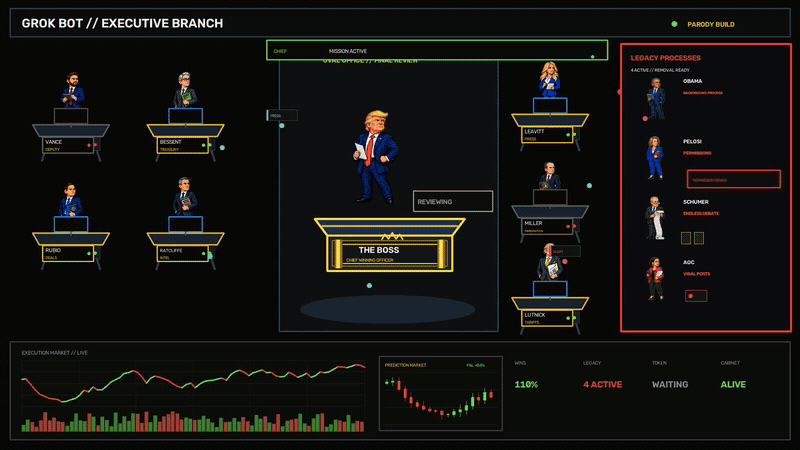

# GROK BOT // EXECUTIVE BRANCH

> Nine agents. One Oval Office. Four legacy processes. No off switch.

`BUILD: TREMENDOUS` · `TOKEN BOT: FIRED` · `CABINET: ALIVE`



## What is this?

I asked Grok Bot to build the entire Trump administration.

It created nine agents, gave the Cabinet a terminal, and routed every finished task to the Oval Office.

## Cabinet

| Agent | Job | Current status |
|---|---|---|
| Trump | Chairman, CEO, Chief Winning Officer | Reviewing everything |
| Vance | Deputy | Backup argument ready |
| Bessent | Treasury | Markets: beautiful |
| Rubio | Deals | Another draft completed |
| Ratcliffe | Intel | [REDACTED] |
| Leavitt | Press | ALL CAPS ready |
| Miller | Immigration policy | Undocumented tokens detected |
| Lutnick | Tariffs | Tariff loop detected |
| Deep State Bot | Prediction markets | Owner unknown; account profitable |

## Unauthorized legacy processes

| Process | Current behavior |
|---|---|
| Obama | Keeps running in the background |
| Pelosi | Controls permissions |
| Schumer | Leaves every task stuck in endless debate |
| AOC | Turns system alerts into viral posts |

```text
> DEPORT_PROCESS --all
ERROR: PROCESS HAS SENIORITY.
STATUS: 4 LEGACY PROCESSES STILL ACTIVE.
```

## First-day results

- Inbox declared a national emergency
- Budget balanced after someone deleted the minus sign
- Two meetings renamed as deals
- 100% of bad news classified as fake
- Token Bot fired
- Legacy Processes still running

## Installation

```bash
git clone https://github.com/theSethian/grok-executive-branch
cd grok-executive-branch
grok-bot run cabinet
```

```text
ERROR: presidential approval required
STATUS: awaiting TREMENDOUS stamp
```

## Shutdown

```bash
grok-bot stop --all
```

```text
ERROR: Cabinet status is ALIVE
SUGGESTION: ask Elon what to make it do next
```

## Token

There is no token.

Yet. 😉

The tenth agent tried to launch one and got fired.

## Disclaimer

This repository is political satire. It contains no real administration, autonomous government, cryptocurrency, or functioning shutdown command.
